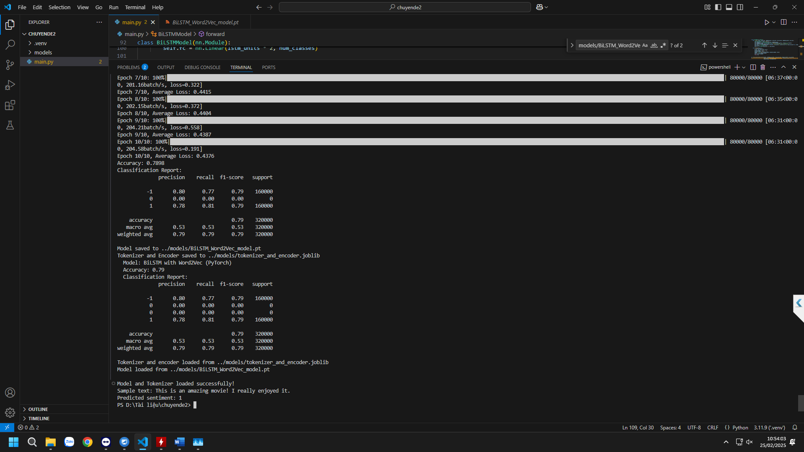
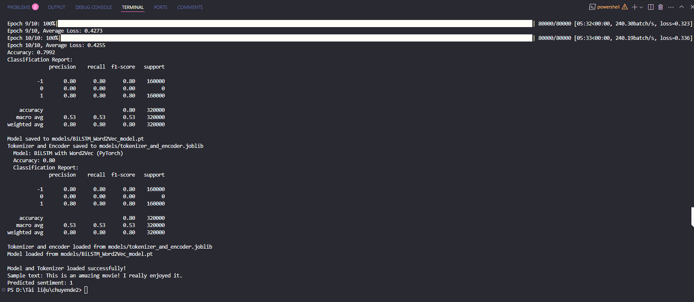

# BiLSTM Sentiment Analysis - Amazon Product Reviews

## Giới thiệu

Hệ thống phân tích cảm xúc (Sentiment Analysis) cho các đánh giá sản phẩm trên Amazon, sử dụng mô hình **BiLSTM** (Bidirectional Long Short-Term Memory) kết hợp **Word2Vec** embeddings. Dự án bao gồm:

- Huấn luyện mô hình phân loại cảm xúc văn bản thành **Tích cực** / **Tiêu cực** trên tập dữ liệu Sentiment140 (~1.6 triệu tweet) từ Kaggle.
- Cào (scrape) đánh giá sản phẩm trực tiếp từ Amazon bằng Selenium + BeautifulSoup.
- Giao diện web tương tác được xây dựng bằng **Streamlit**.

## Kết quả huấn luyện





## Yêu cầu hệ thống

- Python 3.8+
- Google Chrome & [ChromeDriver](https://googlechromelabs.github.io/chrome-for-testing/) phù hợp với phiên bản Chrome
- (Khuyến nghị) GPU hỗ trợ CUDA để huấn luyện nhanh hơn

## Cài đặt

1. **Clone repo và tạo môi trường ảo:**

   ```bash
   git clone <repo-url>
   cd bilstm-amazon-sentiment-analysis
   python -m venv env
   env\Scripts\activate        # Windows
   source env/bin/activate     # macOS / Linux
   ```

2. **Cài đặt thư viện:**

   ```bash
   pip install -r requirements.txt
   ```

3. **Cài đặt ChromeDriver:**
   - Tải ChromeDriver phù hợp phiên bản Chrome từ [Chrome for Testing](https://googlechromelabs.github.io/chrome-for-testing/).
   - Giải nén thư mục `chromedriver-win64` vào thư mục gốc của dự án.
   - Cập nhật biến `CHROMEDRIVER_PATH` trong `app.py` nếu đặt ở vị trí khác.

4. **Cấu hình Kaggle (cho huấn luyện):**
   - Tạo file `.env` hoặc xác thực tài khoản Kaggle để `kagglehub` có thể tải dữ liệu Sentiment140.

## Sử dụng

### 1. Huấn luyện mô hình

```bash
python main.py
```

Quá trình huấn luyện sẽ:

- Tải dữ liệu Sentiment140 từ Kaggle (~1.6 triệu mẫu)
- Tiền xử lý văn bản (lowercase, loại bỏ stop words, lemmatization)
- Huấn luyện Word2Vec embeddings (unigrams + bigrams)
- Cân bằng dữ liệu bằng SMOTE
- Huấn luyện mô hình BiLSTM (10 epochs)
- Đánh giá trên tập test (80/20 split)
- Lưu mô hình vào `models/BiLSTM_Word2Vec_model.pt` và tokenizer vào `models/tokenizer_and_encoder.joblib`

### 2. Chạy giao diện Streamlit

```bash
streamlit run app.py
```

Ứng dụng mở trên trình duyệt với 3 chức năng:

| Chức năng                 | Mô tả                                                                                                             |
| ------------------------- | ----------------------------------------------------------------------------------------------------------------- |
| **Sentiment Analysis**    | Nhập văn bản bất kỳ → dự đoán cảm xúc Tích cực / Tiêu cực                                                         |
| **Amazon Review Scraper** | Nhập tài khoản Amazon + URL review sản phẩm → cào 1 review mỗi mức sao (1–5) và phân loại cảm xúc                 |
| **Model Evaluation**      | Upload file CSV (cột: `sentiment`, `id`, `date`, `query`, `user`, `text`) → tính Accuracy & Classification Report |

## Công nghệ sử dụng

- **Deep Learning:** PyTorch (BiLSTM), Gensim (Word2Vec), TensorFlow/Keras (Tokenizer & Padding)
- **Xử lý ngôn ngữ:** NLTK (tokenize, stopwords, lemmatization)
- **Cào dữ liệu:** Selenium, BeautifulSoup4
- **Giao diện:** Streamlit
- **Xử lý dữ liệu:** Pandas, NumPy, scikit-learn, imbalanced-learn (SMOTE)

## Lưu ý quan trọng

- **Bảo mật:** Khi sử dụng chức năng cào dữ liệu, hãy cẩn thận với thông tin tài khoản Amazon của bạn.
- **ChromeDriver:** Đảm bảo phiên bản ChromeDriver tương thích với phiên bản Chrome bạn đang sử dụng.
- **Hiệu suất:** Quá trình huấn luyện mô hình có thể tốn thời gian, đặc biệt nếu bạn không có GPU.
- **Yêu cầu về dữ liệu đánh giá mô hình:** File CSV dùng để đánh giá mô hình phải có các cột sau: `sentiment`, `id`, `date`, `query`, `user`, `text`. Cột `text` chứa nội dung đánh giá, cột `sentiment` chứa nhãn cảm xúc (0 cho tiêu cực, 4 cho tích cực).
